# 用户指南 (User Guide)
## 快速安装 (Quick Start)

- 构建 (Build)
```bash
cd h-zkc/src/main/resources/static
nvm use 16
npm i && npm run build
cd h-zkc
mvn -Dmaven.test.skip=true clean package -U
```

- 解压 (Unzip)
```bash
cd target
tar xvf h-zkc-1.0-SHAPSHOT.tar.gz
```

- 配置 (Config)
```bash
 cd h-zkc-1.0-SHAPSHOT/deploy/bootstrap/config
 vim application-mysql.yml
```

```yml
spring:
  datasource:
    type: com.zaxxer.hikari.HikariDataSource
    dynamic:
      enabled: true
      base-packages: com.github.hbq969
      default-lookup-key: hikari
    hikari:
      jdbc-url: jdbc:mysql://localhost:3306/xxx?useUnicode=true&allowPublicKeyRetrieval=true&characterEncoding=utf-8&useSSL=false&autoReconnect=true&failOverReadOnly=false&maxReconnects=15000
      driver-class-name: com.mysql.cj.jdbc.Driver
      username: xxx
      password: xxx
      maximum-pool-size: 10
      minimum-idle: 2
      max-lifetime: 1800000
      connection-test-query: SELECT 1

mybatis:
  mapper-locations:
    - classpath*:mappers/*.xml
    - classpath*:**/mapper/common/*Mapper.xml
    - classpath*:**/mapper/mysql/*Mapper.xml
  config-location: classpath:jpaConfig-mysql.xml

zkc:
  urls: localhost:2181
  dialect: mysql
```

- 部署 (Deploy)
```bash
cd h-zkc-1.0-SHAPSHOT/deploy/bootstrap
sh start.sh
```

# 功能展示 (Features)
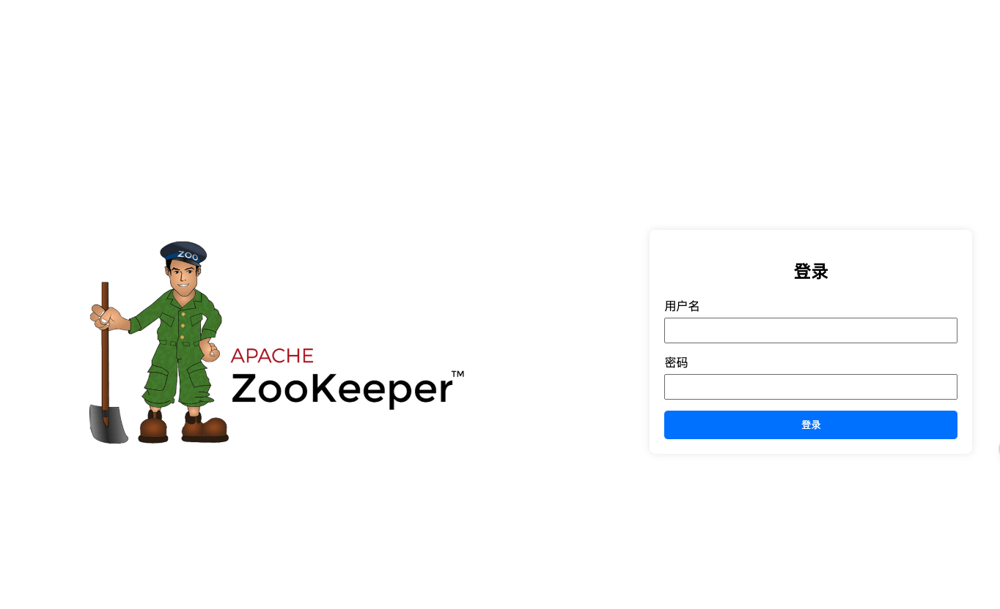

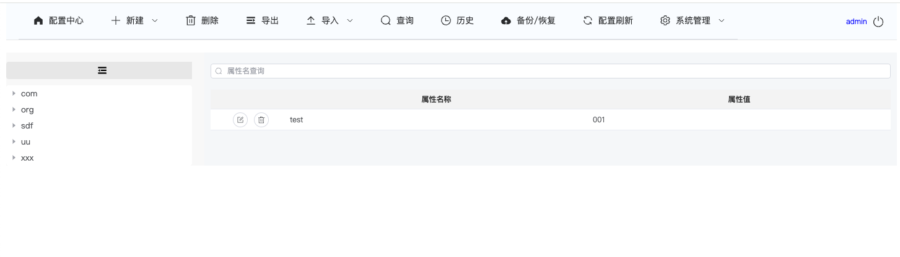

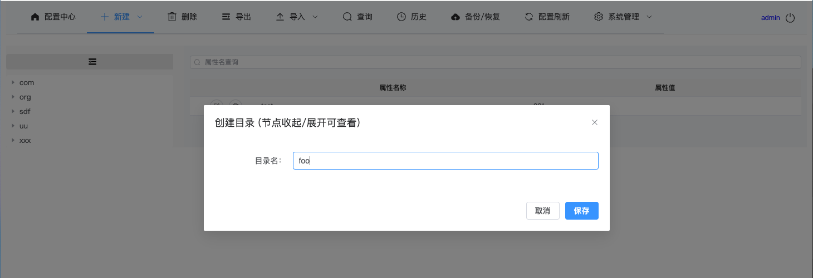

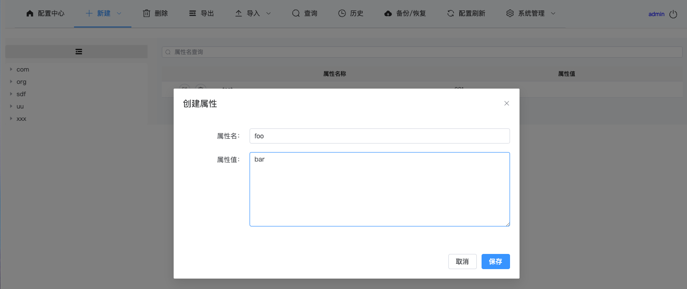

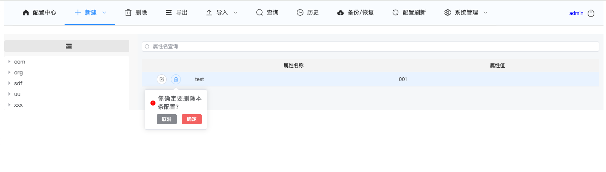

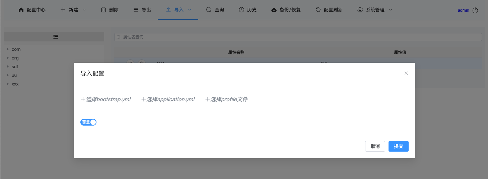

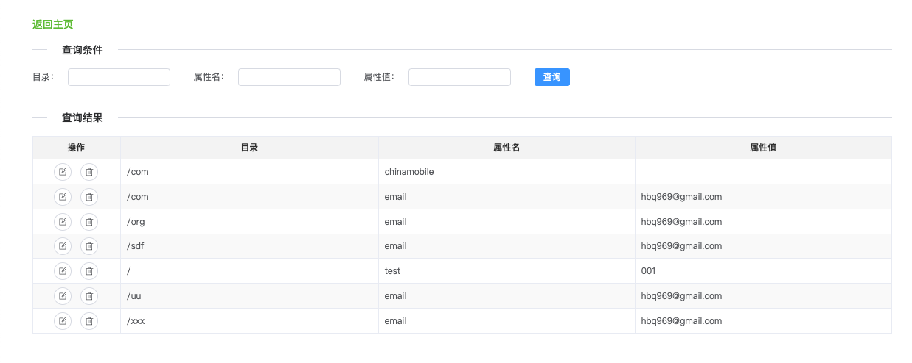

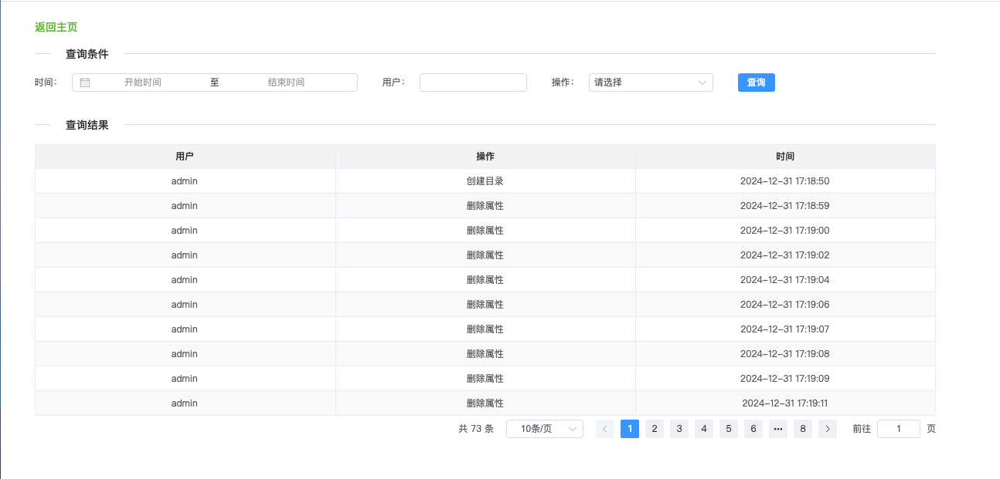

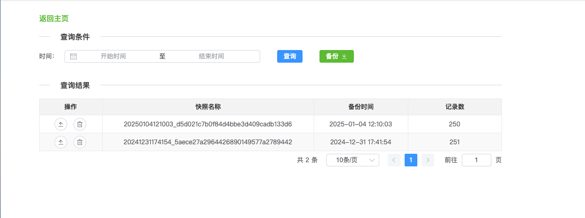

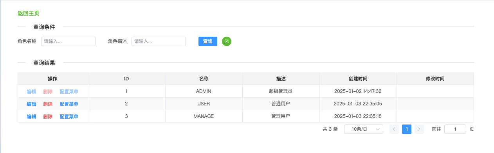

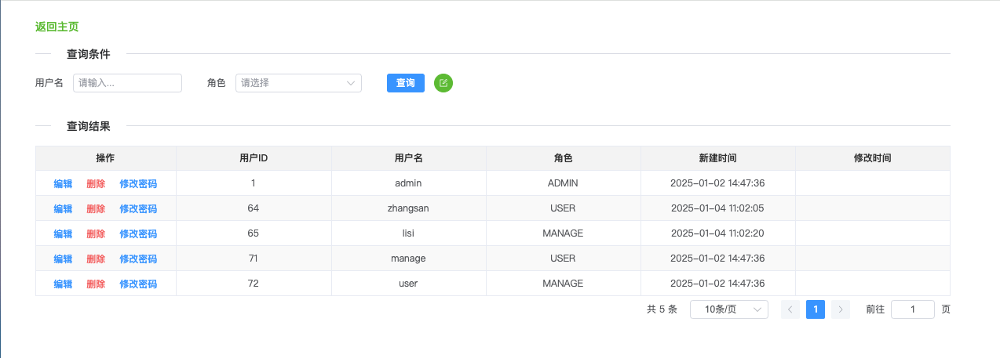

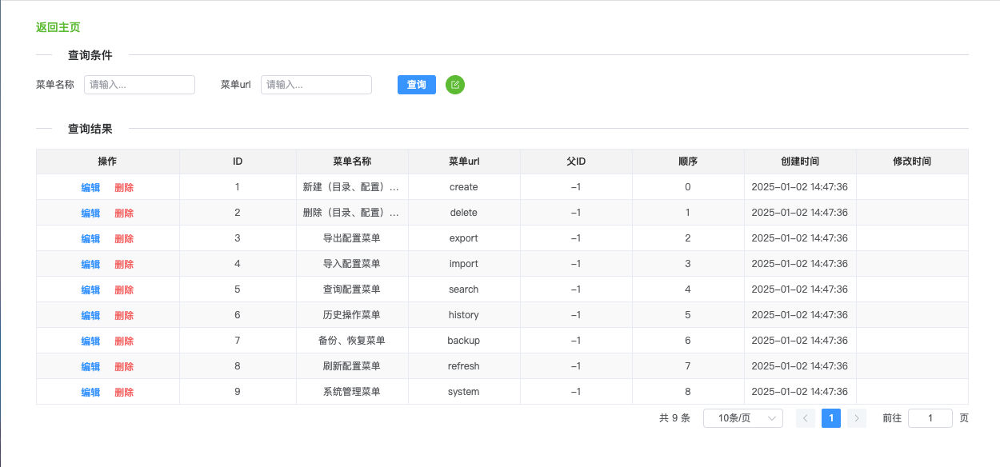


## 问题联系 (Contact)

[hbq969@gmail.com](mailto:hbq969@gmail.com)


## 许可 (License)

The MIT License (MIT)

Copyright (c) 2024 hbq969

Permission is hereby granted, free of charge, to any person obtaining a copy of
this software and associated documentation files (the "Software"), to deal in
the Software without restriction, including without limitation the rights to
use, copy, modify, merge, publish, distribute, sublicense, and/or sell copies of
the Software, and to permit persons to whom the Software is furnished to do so,
subject to the following conditions:

The above copyright notice and this permission notice shall be included in all
copies or substantial portions of the Software.

THE SOFTWARE IS PROVIDED "AS IS", WITHOUT WARRANTY OF ANY KIND, EXPRESS OR
IMPLIED, INCLUDING BUT NOT LIMITED TO THE WARRANTIES OF MERCHANTABILITY, FITNESS
FOR A PARTICULAR PURPOSE AND NONINFRINGEMENT. IN NO EVENT SHALL THE AUTHORS OR
COPYRIGHT HOLDERS BE LIABLE FOR ANY CLAIM, DAMAGES OR OTHER LIABILITY, WHETHER
IN AN ACTION OF CONTRACT, TORT OR OTHERWISE, ARISING FROM, OUT OF OR IN
CONNECTION WITH THE SOFTWARE OR THE USE OR OTHER DEALINGS IN THE SOFTWARE.